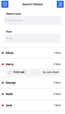

# Visitor Access
## How to build and run the app:

### iOS:
Cocoapods should be installed
```
$ npm run refresh (In case there is some problems with finding pods - try pod repo update)
$ npm run ios (or Run with Xcode)
```

### Android:
```
$ npm run refresh
$ npm run android
```

### Username & Password for testing
```
smith/123
doe/123
```

##### For integration with third-party backend change BASE_URL in `src/configs/index.js`
```js
export const BASE_URL = 'http://your.base.url';
```


---
  


## Designed & Created by
[](https://www.kandasoft.com/) [](https://softteco.com/) 

