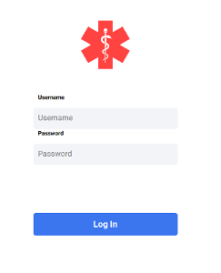
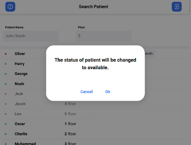

# Visitor Access

## How to build the app

```
yarn build
```
### Username & Password for testing
```
smith/123
doe/123
```


#### For integration with third-party backends change API_BASE_ADDRESS in `src/api/api.js`
```js

const API_BASE_ADDRESS = 'http://your.base.url';
```
#### Technologies
[React](https://reactjs.org/), [Redux](https://redux.js.org/), [Rest API](https://restfulapi.net/)

---
  


## Designed & Created by
[](https://www.kandasoft.com/) [](https://softteco.com/)
